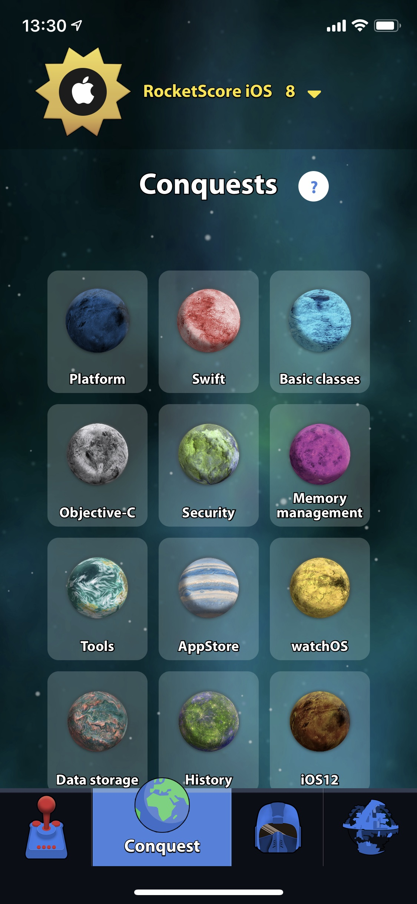
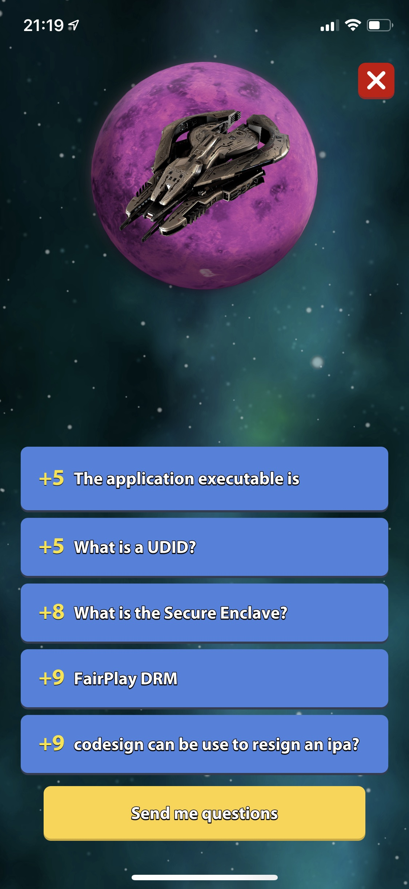
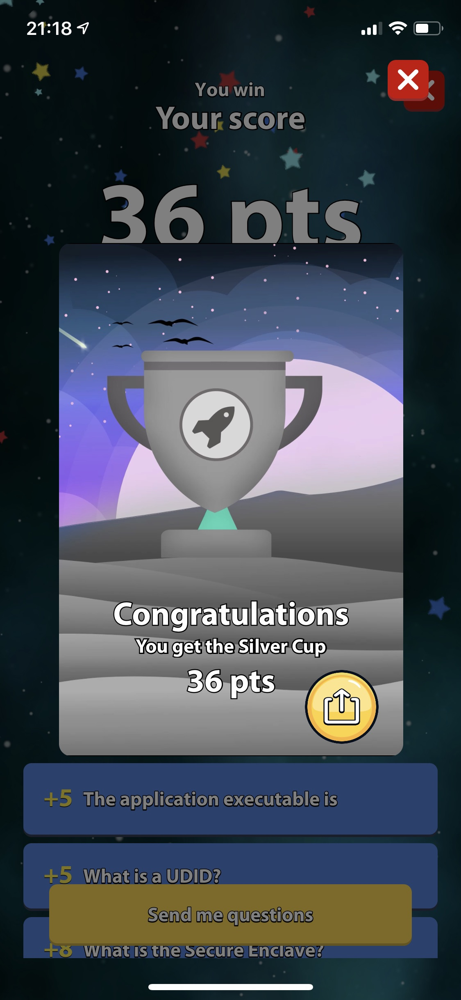
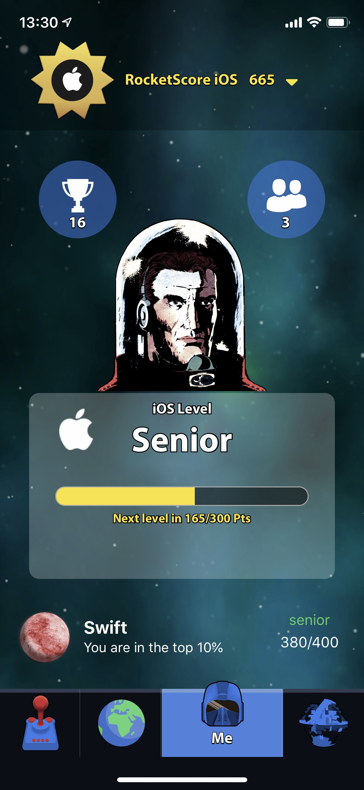

# Essential iOS Interview Questions from [RocketSkill Application](https://apps.apple.com/fr/app/rocketskill-test-your-swift/id1398486838)

Interview Questions for getting you ready for your interview
A small guide to help those looking to hire a developerfor iOS.
A great self-test if you're looking to keep current or practice for your own interview.
All you need to know about iOS technical interview including some tips for preparing, questions and some coding exercises

## iOS domains
We have organized the questions to better address each focus point.
- [swift](#swift)
- [Objective-C](#objective-c)
- [Basic Classes](#basic-classes)
- [Memory Management](#memory-management)
- [Algorithms](#algorithms)
- [Plateform](#plateform)
- [Security](#security)
- [Tools](#tools)
- [Internationalization-Localization](#internationalization-localization)
- [Design Pattern](#design-pattern)
- [Data Storage](#data-storage)
- [AppStore](#appstore)
- [watchOS](#watchoS)
- [tvOS](#tvos)
- [SwiftUI](#swiftui)
- [iOS13](#ios13)

## Swift
- Who is the Swift creator?
- What is the difference between unowned and weak variables?
- How is manager memory in a Swift program?
- What is the Optional Binding?
- What is Swift Optional?
- What is a typealias?
- What is tuple? 
- When to use guard?
- What problems can be solved using Generics?

## Objective-C
- Why do we use @synchronized?
- What is protocol in Objective-C?
- How do you declare an informal protocol?
- How do we check that Optional methods are implemented at Runtime?
- What are accessor methods?
- Advantages of categories?
- KVO declaration, usage?
- KVC declaration, usage?

## Basic Classes
- I need a webView in my app, which class should i use?
- NS_DESIGNATED_INITIALIZER?
- What is the size and precision of CGFloat?
- UITableView, estimatedRowHeight
- UITableViewController
- What is Self-Sizing Table View Cells?
- A cell of a TableView must be of what type?
- UIStackView usage and available since?
- UICollectionView usage and available since?
- UIAlertView usage
- UIAlertViewController usage
- Any VS Anyobject
- Category/Extension VS Protocol
- Category/Extension VS Inheritance
- Category/Extension VS Inheritance
- NSSet VS NSArray
- NSDictionary VS NSMutableArray
- Bound VS Frame

## Memory Management
- How it's works?
- ARC
- weak
- strong
- Swift structures
- Swift classes
- Unowned
- Retain cycle problems, analysis, solutions?
- Delegation, property attributes
- Low memory, problems, analysis, solutions?

## Algorithms
- What are algorithms?
- Why learn algorithms? 
- This algorithm is O(n)." What that means?
- Complexity n, logN, n2
- Recursive algorithm 

## Plateform  
- AutoLayout / Auto resizing masks
- XIB
- XIB vs NIB
- Storyboard
- arm processors
- armV7/armV7s, arm64
- GCD
- App Thinning
- What is a .dSYM file?
- Xcode 11, targetable OS versions?
- @1x, @2x, @3x
- On-Demand Resources
- How to perform multitasking?
- NSLocalizedString
- Bitcode
- IBInspectable
- IBDesignable

## Security
- http / https / TLS
- App Transport Security
- CodeSign
- Touch ID
- Face ID
- UDID
- TLS
- .ipa
- .ipsw
- keychain
- AppGroups

## Tools
- xcode-select
- Lottie 
- Testflight
- Carthage
- SwiftPacketManager
- Cocoapods
- SonarQube
- Fabric 
- Firebase

## Internationalization / Localization
- Primary language on iTunesConnect
- DateFormatter
- Plural forms / languages?
- .stringsdict
- Internationalization Vs Localization

## Design Pattern
- What is a design pattern?
- MVC
- Singleton
- Delegation
- MVP 
- MVVM 
- Decorator
- Observer Pattern

## Data Storage 
- UserDefault
- App-sandboxing, what's that means?
- keychain
- NSCoding 
- CoreData 
- Realm 

## AppStore
- bundle ID
- Screenshots sizes? 
- 4-Inch Retina Display
- 4.7-Inch Retina Display
- 5.8-Inch Super Retina Display
- App Size 
- App download limit size
- Localization description? 
- Keywords limits?
- Forbidden words?

## watchOS
IN PROGRESS

## tvOS
IN PROGRESS

## SwiftUI
- min iOS version
- min Xcode version
- Binding 
- UIHostingController
- UIViewRepresentable

## iOS13
- New OS features?
- Dark Mode rendering
- Combine

Domains             |  The Battle  |  Results | Cups | Seniority
:-------------------------:|:-------------------------:|:-------------------------:|:-------------------------:|:-------------------------:
  |  |  |  |  

## Contributions 
If you want to add subjets of interviews. Those subjets can be added to RocketSkill App and if you want you will be named in in the question add contributors.

- Open an issue
- Or fork and submit a merge request

## Other plateforms
IN PROGRESS
